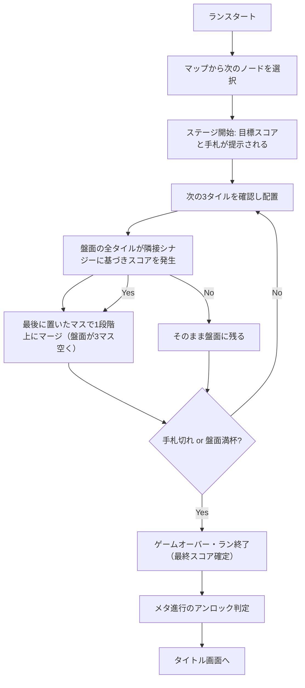

# 企画書:『盤上算段(仮)』
**一人用・戦略パズル・ローグライト**

> 一手先を読めるかどうかが、全てを分ける。

## 前提条件
- ジャンル:戦略・頭脳系
- プレイ人数:一人用(じっくり型)
- 開発規模:1〜2ヶ月の中規模

## コンセプト
盤面に流れてくるタイルを配置し、**「盤面全体を一つの稼ぐエンジン（街）」**として構築していくパズルローグライトです。
毎ターン（タイルを1つ配置するたび）、盤面に存在するすべてのタイルがそれぞれの能力と隣接シナジーに基づいてスコア（収入）を発生させます。

盤面をタイルで埋めるほど毎ターンのスコアは跳ね上がりますが、放置すればあっという間に盤面が埋まってゲームオーバーになります（**リターンとリスクのジレンマ**）。
同じ属性のタイルを4つ隣接させると「マージ（合体）」してレベルが上がり、場所が空く上に強力になりますが、マージするためには「稼ぎ効率の悪い配置」を一時的に受け入れなければならない（リスクを取るか、安全に圧縮するか）という深い戦略性が求められます。

## ジャンル・立ち位置
「テトリス×スイカゲーム」のパズルをコアにしつつ、『Slay the Spire』のような**ルート選択、デッキ構築、レリック（遺物）収集**といった本格的なローグライト要素を融合させたゲームです。「見えている情報からどう最適な手を組み立てるか」というパズルとしての先読みと、「どのルートを選び、どの能力を獲得していくか」というビルド構築の面白さを両立させます。

## コアループ

## 主要システム

### 1. 盤面と毎ターン収入（エンジン構築）
- 盤面は8×8程度の正方形グリッド。
- タイルを1枚配置するたびに、盤面にある全動物がスコア（ハッピー）を生成します。
- タイルには「アザラシ」「ペンギン」「シロクマ」「リス」の4種類があり、それぞれ**隣接シナジー**が異なります。
  - **アザラシ**: 空きマスが隣にあるほど「のびのびゴロゴロ」して稼ぐ
  - **ペンギン**: 違う種類の動物が隣にあるほど「わいわい好奇心」で稼ぐ
  - **シロクマ**: 単体で高得点だが、隣接するアザラシ・リスを怖がらせてスコアを0にしてしまう（お邪魔要素）
  - **リス**: ペンギン・リスが隣にあるほど稼ぐが、シロクマが隣にいると隠れてしまう

### 2. マージ（成長）とリスク管理
- 同じ属性かつ同じレベルのタイルが4つ隣接すると合体（マージ）し、最後に配置したマスに「レベルが1つ上がったタイル」が生成されます。
- 高レベルのタイルは基本スコア・シナジー効果が数倍に跳ね上がります。
- 盤面を圧縮して死（ゲームオーバー）を回避するための唯一の手段ですが、マージするためには「稼ぎ効率の悪い配置」を経由する必要があり、常にリスクとリターンが問われます。

### 2. 先読みキュー
- 手札は1枚引きのランダムではなく、次に来る3枚が常に見える「キュー方式」
- 「見えている情報をどう活かすか」を問う設計にすることで、運より読みを重視した頭脳系としての手応えを担保します

### 3. 特殊アクション（ワイルドカード）
※現在は実装見送り。盤面の動物の可愛さと、配置のジレンマというパズル本来の面白さにフォーカスするため一旦削除されました。

### 4. リソースと終了条件（スコアアタック）
- 手札（デッキ）は有限です（例：40枚〜）。
- 手札を使い切るか、盤面が完全に埋まってタイルが置けなくなると**ゲームオーバー**となり、その時点での累計スコアが最終記録となります。
- 「決められた枚数の中でいかに効率よく稼ぐか」を競うスコアアタック制です。

### 5. ローグライト要素：メタ進行と報酬
- **デッキ構築**: 今後のアップデートで、道中の特定タイミングで手札を補充したり、特殊タイルを獲得できる要素を追加予定。
- **レリック（遺物）**: 今後のアップデートで、特定スコア到達時などに永続パッシブ効果を獲得できる要素を追加予定。

### 6. メタ進行
ラン終了後、獲得した最終スコア（ポイント）で次回以降に解禁される要素を購入できます:
- 新しいレリックや特殊タイルのアンロック
- スタート時のボーナス（初期資金、初期レリックなど）

## 画面構成イメージ
- **タイトル画面**:スタート/アンロック一覧/設定
- **ゲーム画面**:盤面(中央)、次の3タイル(上部)、スコア・コンボ倍率(右上)、残デッキ枚数(右下)
- **ラン終了画面**:今回のスコア、ベスト更新の有無、獲得ポイント、アンロック通知

## 技術スタック・実装方針
- **フロント**:Next.js(App Router)+ React + TypeScript
- **状態管理**:基本はReactのstate/hooksで対応、複雑化した場合はZustand導入を検討
- **保存**:MVPはlocalStorageでベストスコア・アンロック状況を保持(バックエンド不要)
- **演出**:Framer MotionまたはCSS transitionでコンボ時の気持ちよさを作り込む(このジャンルは演出の気持ちよさが体験の半分を占めます)
- **効果音**:howler.jsなどでSE実装(優先度高め)
- **デプロイ**:Firebase

## テーマ(見た目)の方向性

**流氷と動物たち（ぽかぽかアザラシパズル）**: 
- 見た目は「スイカゲーム」のように、パステルカラー基調で、もっちり・ぽよぽよした丸みのあるキャラクター。
- ユーザーのアイコンである「頭にリスを乗せたアザラシ」を最大レベルの姿として採用。
- 盤面が埋まってゲームオーバーになる絶望感と、動物たちがいっぱいで可愛いというポジティブな感情が同居するコミカルな世界観。